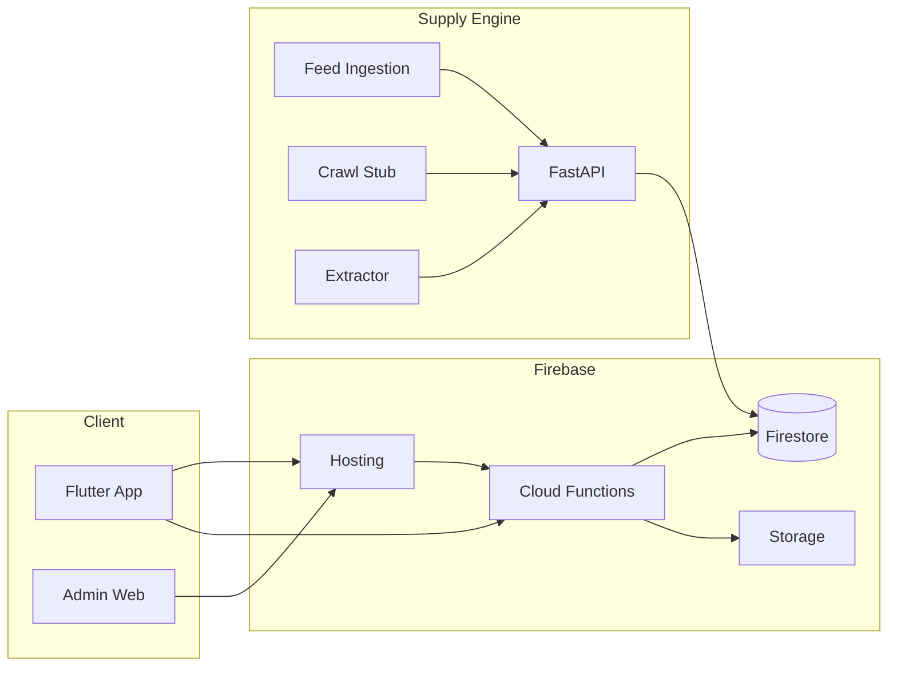

# Swiper – Architecture

## High-level

```
+----------+     +------------------+     +----------------+
| Flutter  |     | Firebase         |     | Supply Engine  |
| App      |---->| Hosting +        |<----| (FastAPI)      |
| (PWA)    |     | Functions +      |     | Feed/Crawl     |
|          |     | Firestore        |     | Ingestion      |
+----------+     +------------------+     +----------------+
       |                  |                        |
       v                  v                        v
   /deck, /likes,     /api/*, /go/*           items, runs,
   /s/:token         Firestore writes        jobs
```

- **Flutter**: Single codebase (iOS, Android, Web PWA). `go_router` for app + `/admin/*` and `/s/:token`. Web build deployed to Firebase Hosting.
- **Firebase**: Firestore = primary DB; Cloud Functions = REST API (`/api/*`) + redirect (`/go/:itemId`); Hosting serves Flutter web and rewrites to Functions.
- **Supply Engine**: Python FastAPI; reads sources from config (or Firestore); runs feed/crawl jobs; writes `items`, `ingestionRuns`, `ingestionJobs`. Triggered via `POST /admin/run` (Functions call Supply Engine).

## Data flow

1. User opens app → `POST /api/session` → store `sessionId` locally.
2. Deck → `GET /api/items/deck?sessionId=...` → ranked items (exclude seen, apply preference weights).
3. Swipe → `POST /api/swipe` → record swipe, update preference weights, log event.
4. Like → `POST /api/likes/toggle` → add/remove like, log event.
5. Share → `POST /api/shortlists/create` → return `shareToken` → link `/s/:token`.
6. Outbound → open `https://<host>/go/:itemId` → Function logs `outbound_click`, 302 to `outboundUrl` with UTM.

## Mermaid


